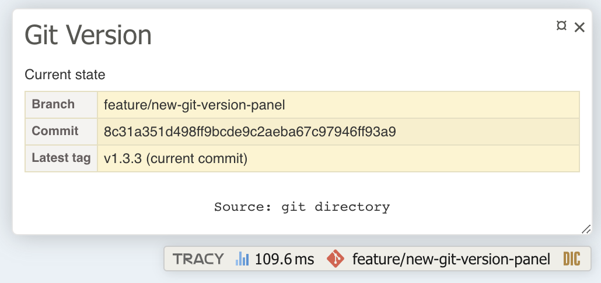

<div align="center">
<h1 align="center">Tracy Git version panel</h1>

Simple and extensible panel for [Tracy](https://github.com/nette/tracy) that shows information from Git.


</div>

## Table of contents

* [Installation](#installation)
* [Basic integration](#basic-integration)
* [Solution for application builds without Git](#solution-for-application-builds-without-git)
* [Advanced guide](#advanced-guide)
* [Contributing](#contributing)
* [License](#license)

## Installation

The best way to install `68publishers/tracy-git-version-panel` is using Composer:

```bash
$ composer require 68publishers/tracy-git-version-panel
```

## Basic integration

### Standalone Tracy integration

The simplest way how to register the panel into Tracy is by creating a default instance and providing it directly into a Bar.

```php
<?php

use Tracy\Debugger;
use SixtyEightPublishers\TracyGitVersionPanel\Bridge\Tracy\GitVersionPanel;

Debugger::getBar()->addPanel(GitVersionPanel::createDefault());
```

### Integration into Nette Framework

Basic integration into Nette is really simple. Just register an extension.

```neon
extensions:
	68publishers.tracy_git_version_panel: SixtyEightPublishers\TracyGitVersionPanel\Bridge\Nette\DI\TracyGitVersionPanelExtension
```

And everything works 😉

## Solution for application builds without Git

Often when we deploy an application to a production environment, neither Git nor the `.git` directory is available due to trying to have a build as small as possible.
However, at this moment we have no source of information about the current version. The solution is to export a file that contains all important information at the time when the Git is still accessible.

### Setup for standalone Tracy

You must create repositories and the panel manually but there is not much work to do.

```php
<?php

use Tracy\Debugger;
use SixtyEightPublishers\TracyGitVersionPanel\Bridge\Tracy\GitVersionPanel;
use SixtyEightPublishers\TracyGitVersionPanel\Repository\LocalGitRepository;
use SixtyEightPublishers\TracyGitVersionPanel\Repository\ExportedGitRepository;
use SixtyEightPublishers\TracyGitVersionPanel\Repository\ResolvableGitRepository;
use SixtyEightPublishers\TracyGitVersionPanel\Repository\RuntimeCachedGitRepository;
use SixtyEightPublishers\TracyGitVersionPanel\Bridge\Tracy\Block\CurrentStateBlock;

# create a repository that reads from the .git directory:
$localGitRepository = LocalGitRepository::createDefault();

# create a repository that reads from a JSON export:
$exportedGitRepository = ExportedGitRepository::createDefault('/var/git-version/repository.json');

# combine there two repositories, if the .git directory is not accessible then try to read from the export file:
$resolvableGitRepository = new ResolvableGitRepository([$localGitRepository, $exportedGitRepository]);

# add runtime cache, commands results are stored so there are no duplicated calls to the real repository:
$cachedGitRepository = new RuntimeCachedGitRepository($resolvableGitRepository);

# add the panel into Tracy
Debugger::getBar()->addPanel(new GitVersionPanel($cachedGitRepository, [new CurrentStateBlock()]));
```

### Setup for Nette Framework

The setup for Nette is more simple. Just add another extension into your neon configuration.

```neon
extensions:
	68publishers.tracy_git_version_panel: SixtyEightPublishers\TracyGitVersionPanel\Bridge\Nette\DI\TracyGitVersionPanelExtension
	68publishers.tracy_git_version_panel.export: SixtyEightPublishers\TracyGitVersionPanel\Bridge\Nette\DI\TracyGitVersionPanelExportExtension
```

The default name for the exported file is `%tempDir%/git-version/repository.json` but you can change it.

```neon
68publishers.tracy_git_version_panel.export:
    export_filename: %tempDir%/my/custom/path.json
```

### Creating the export file

The export file should be created by executing a script that is located in the composer's `bin` directory.
The script is independent of the application so you must provide the filename of the exported file as an option.

```bash
$ vendor/bin/tracy-git-version-panel export-repository --output-file <your_temp>/git-version/repository.json -vv
```

## Advanced guide

If you want to read more about repositories, how to extend them or how to add custom data into the panel, please see the [Advanced guide](docs/advanced-guide.md).

## Contributing

Before committing any changes, don't forget to run

```bash
$ composer run php-cs-fixer
```

and

```bash
$ composer run tests
```

## License

The package is distributed under the MIT License. See [LICENSE](LICENSE.md) for more information.
