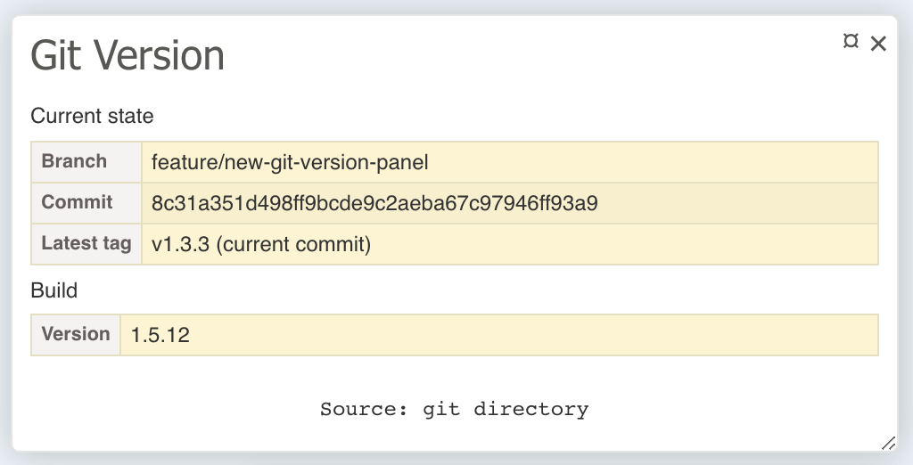

# Advanced guide

## Table of contents

* [Git repository service and extending](#git-repository-service-and-extending)
* [Extending the panel](#extending-the-panel)
* [Extending the export file](#extending-the-export-file)

## Git repository service and extending

All information from Git is provided through a service of type `SixtyEightPublishers\TracyGitVersionPanel\Repository\GitRepositoryInterface`.
If you are using the Nette integration the service is accessible in the application's DI Container.

Following repository implementations are implemented:

- `LocalGitRepository` - Reads information from the `.git` directory
- `ExportedGitRepository` - Reads information from [a exported JSON file](../README.md#creating-the-export-file)
- `ResolvableGitRepository` - Combines more repositories into one. The first one that has an available data source (e.g. existing git directory/JSON file) is used.
- `RuntimeCachedGitRepository` - Stores results returned by commands so there are no duplicated executions

As you probably guessed the `ResolvableGitRepository` and `RuntimeCachedGitRepository` are just decorators so real data fetching is done by the `LocalGitRepository` and `ExportedGitRepository`

### Default commands

The package comes with the following commands

- `GetHeadCommand`
- `GetLatestTagCommand`

### Custom commands and handlers

Commands must implements an interface `SixtyEightPublishers\TracyGitVersionPanel\Repository\GitCommandInterface` and handlers must implements an interface `SixtyEightPublishers\TracyGitVersionPanel\Repository\GitCommandHandlerInterface`.

Also, there are these two interfaces for handlers:

- `LocalDirectoryGitCommandHandlerInterface` - commands for the `LocalGitRepository`, git directory is automatically provided by the repository for these handlers
- `ExportedGitCommandHandlerInterface` - commands for the `ExportedGitRepository`, an array that is parsed from the export file is automatically provided by the repository for these handlers 

Let's show an example. Suppose we want to create a command to find out the git history:

```php
<?php

namespace App\GitRepositoryPanel\Command;

use SixtyEightPublishers\TracyGitVersionPanel\Repository\GitCommandInterface;

final class ListHistoryCommand implements GitCommandInterface
{
    private int $lines;

    public function __construct(int $lines)
    {
        $this->lines = $lines;
    }

    public function getLines() : int
    {
        return $this->lines;
    }

    public function __toString() : string
    {
        return sprintf('LIST_HISTORY(%s)', $this->lines);
    }
}
```

Now we need a handler for the command that will read history from the git directory:

```php
<?php

namespace App\GitRepositoryPanel\LocalDirectory;

use App\GitRepositoryPanel\Command\ListHistoryCommand;
use SixtyEightPublishers\TracyGitVersionPanel\Repository\LocalDirectory\CommandHandler\AbstractLocalDirectoryCommandHandler;

final class ListHistoryCommandHandler extends AbstractLocalDirectoryCommandHandler
{
    public function __invoke(ListHistoryCommand $command) : array
    {
        # get the path to .git directory
        $directory = (string) $this->getGitDirectory();
        $linesCount = $command->getLines();

        # find and parse the history inside the directory;

        # return rows, you can return what you want e.g. array of any objects that represents history records
        return [...];
    }
}
```

:exclamation: Remember, when you are using the `ExportedGitRepository` you also must implement the same handler for the repository:

```php
<?php

namespace App\GitRepositoryPanel\Export;

use App\GitRepositoryPanel\Command\ListHistoryCommand;
use SixtyEightPublishers\TracyGitVersionPanel\Repository\Export\CommandHandler\AbstractExportedCommandHandler;

final class ListHistoryCommandHandler extends AbstractExportedCommandHandler
{
    public function __invoke(ListHistoryCommand $command) : array
    {
        # get an array with values
        $value = $this->getExportedValue();

        # find the history in the $value and do with it what you want...

        # return rows, you can return what you want e.g. array of any objects that represents history records
        return [...];
    }
}
```

Results from both handlers should be the same type of value.

### Registering custom commands

If you are using standalone Tracy you must register custom handlers for commands directly into the repositories.

```php
<?php

use App\GitRepositoryPanel\Export;
use App\GitRepositoryPanel\LocalDirectory;
use App\GitRepositoryPanel\Command\ListHistoryCommand;
use SixtyEightPublishers\TracyGitVersionPanel\Repository\LocalGitRepository;
use SixtyEightPublishers\TracyGitVersionPanel\Repository\ExportedGitRepository;

# create a repository that reads from the .git directory:
$localGitRepository = LocalGitRepository::createDefault();
$localGitRepository->addHandler(ListHistoryCommand::class, new LocalDirectory\ListHistoryCommandHandler())

# create a repository that reads from a JSON export:
$exportedGitRepository = ExportedGitRepository::createDefault('/var/git-version/repository.json');
$exportedGitRepository->addHandler(ListHistoryCommand::class, new Export\ListHistoryCommandHandler())

# wrap repositories into the ResolvableGitRepository, RuntimeCachedGitRepository, and create the panel...
```

When you are using Nette integration then you should register the handlers in the configuration:

```neon
68publishers.tracy_git_version_panel:
    command_handlers:
        App\GitRepositoryPanel\Command\ListHistoryCommand: App\GitRepositoryPanel\LocalDirectory\ListHistoryCommandHandler

68publishers.tracy_git_version_panel.export:
    command_handlers:
        App\GitRepositoryPanel\Command\ListHistoryCommand: App\GitRepositoryPanel\Export\ListHistoryCommandHandler
```

## Extending the panel

By default, the panel contains the most useful information like the current branch, commit hash, and latest tag. But you are able to add any information you want.
The whole panel is made up of blocks which are classes that implement an interface `SixtyEightPublishers\TracyGitVersionPanel\Bridge\Tracy\Block\BlockInterface`.

### Extending with a simple table

If you want to add some additional data that are not provided from Git you can use predefined `SimpleTableBlock`.

```php
<?php

use SixtyEightPublishers\TracyGitVersionPanel\Bridge\Tracy\GitVersionPanel;
use SixtyEightPublishers\TracyGitVersionPanel\Bridge\Tracy\Block\SimpleTableBlock;

$panel = GitVersionPanel::createDefault()
    ->addBlock(new SimpleTableBlock([
        'Version' => BUILD_VERSION,
    ], 'Build'));
```

Respectively

```neon
68publishers.tracy_git_version_panel:
    panel:
        blocks:
            - SixtyEightPublishers\TracyGitVersionPanel\Bridge\Tracy\Block\SimpleTableBlock([
                Version: %build_version%
            ], Build)
```

The panel will look something like this:



### Extending with custom Git information

If you have declared some [custom commands](#custom-commands-and-handlers) and you want to show results in the panel then you can create your own block class.

```php
<?php

use SixtyEightPublishers\TracyGitVersionPanel\Bridge\Tracy\Block\BlockInterface;
use SixtyEightPublishers\TracyGitVersionPanel\Repository\GitRepositoryInterface;
use SixtyEightPublishers\TracyGitVersionPanel\Bridge\Tracy\Helpers;

final class HistoryBlock implements BlockInterface
{
    public function render(GitRepositoryInterface $gitRepository) : string
    {
        # read and process data from the repository

        # HTML code can be returned directly
        return '... custom html ...';

        # or render .phtml template (better way)
        return Helpers::renderTemplate(__DIR__ . '/history.phtm', [...]);
    }
}
```

Now you can register the block in the same way as `SimpleTableBlock` from the previous example.

### Extending the export file

If you are using the `ExportedGitRepository` and you have custom [repository commands](#git-repository-service-and-extending) then you also need to extend the export with your own data. This will be achieved by creating a PHP configuration file and a custom exporter.

```php
<?php

namespace App\GitRepositoryPanel\Exporter;

use SixtyEightPublishers\TracyGitVersionPanel\Export\ExporterInterface;
use SixtyEightPublishers\TracyGitVersionPanel\Exception\BadMethodCallException;
use SixtyEightPublishers\TracyGitVersionPanel\Export\Config;
use SixtyEightPublishers\TracyGitVersionPanel\Repository\GitRepositoryInterface;

class HistoryExporter implements ExporterInterface
{
    public function export(Config $config, ?GitRepositoryInterface $gitRepository) : array
    {
        if (NULL === $gitRepository) {
			throw BadMethodCallException::gitRepositoryNotProvidedForPartialExporter($this);
		}

        # fetch data from the repository with your own command:
        # $data = $gitRepository->handle(new ListHistoryCommand(10));

        return [
            'history' => ...
        ];
    }
}
```

If you need a more realistic example please look into some [existing exporter](../src/Export).

The configuration file might look something like this:

`git-version-config.php`
```php
<?php

use App\GitRepositoryPanel\Exporter\HistoryExporter;
use App\GitRepositoryPanel\Command\ListHistoryCommand;
use App\GitRepositoryPanel\LocalDirectory\ListHistoryCommandHandler;

use SixtyEightPublishers\TracyGitVersionPanel\Export\Config;

return Config::createDefault()
    ->setOutputFile(__DIR__ . '/temp/git-version/repository.json') # you can define the filename here so the option `--output-file` can be omitted
    ->addCommandHandlers([
        ListHistoryCommand::class => new ListHistoryCommandHandler(), # register own command handler (that one that reads from the git directory)
    ])
    ->addExporters([
        new HistoryExporter(),
    ]);
```

Now execute the following command that regenerates the export file:

```bash
$ vendor/bin/tracy-git-version-panel export-repository --config git-version-config.php -vv
```

As you can see the option `--output-file` is not needed because we already defined the filename in the config.
